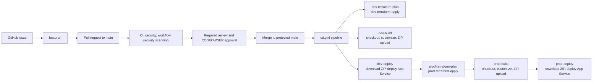
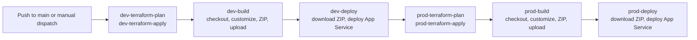

# DevSecOps Automation Repository

This repository is a controlled, automated release process demonstration combining GitHub issues and pull requests, GitHub Actions, Terraform, Azure Blob Storage, and Azure App Service. It serves as a foundation for implementing secure, trunk-based development workflows with built-in security scanning and infrastructure-as-code practices.

## Start here

| If you want to...                                   | Read                                                             |
| --------------------------------------------------- | ---------------------------------------------------------------- |
| Understand exactly what happens during a release    | [Application release flow](docs/release-flow.md)                 |
| Set up the repository and GitHub environments       | [DevSecOps Automation Setup](docs/DEVSECOPS-AUTOMATION-SETUP.md) |
| Understand the Azure architecture and identity flow | [Architecture summary](docs/architecture-summary.md)             |
| Understand the scope and assumptions of this setup  | [Assumptions](docs/assumptions.md)                               |
| Inspect the deployed SPA                            | [`src/`](src/)                                                   |
| Inspect the infrastructure definition               | [`iac/`](iac/)                                                   |

The most important release document is
[docs/release-flow.md](docs/release-flow.md). It contains the detailed
diagrams and step-by-step behavior for build, Blob Storage upload, package
download, and App Service deployment.

## What this repository demonstrates

- Trunk-based delivery through protected `main`.
- Issue-driven feature branches named
  `feature/<issue-number>-<short-name>`.
- Pull-request validation, secret scanning, and workflow security scanning.
- Automated verification that a pull request satisfies its linked issue.
- Terraform plan and apply for Development and Production infrastructure.
- Environment-specific SPA packages stored in a private Azure Blob Storage
  `release` container.
- Ordered application promotion:
  **Development**: tf-plan → tf-apply → build → deploy
  **Production**: tf-plan → tf-apply → build → deploy
- Azure authentication from GitHub Actions using OpenID Connect (OIDC)
  instead of stored Azure credentials.
- Production approval through the protected GitHub `Production` environment.

This is a process-focused demonstration. The application itself is intentionally a
small static site to focus on the release and DevSecOps workflows.

## Repository map

| Path                                                                                   | Purpose                                                                                    |
| -------------------------------------------------------------------------------------- | ------------------------------------------------------------------------------------------ |
| [`src/`](src/)                                                                         | Static SPA source: `index.html`, `styles.css`, and `script.js`.                            |
| [`iac/`](iac/)                                                                         | Root Terraform configuration, environment backends/variables, and the reusable SPA module. |
| [`scripts/drift_check.py`](scripts/drift_check.py)                                     | Collects issue, PR, patch, and final-file evidence for the issue drift check.              |
| [`.github/workflows/ci.yml`](.github/workflows/ci.yml)                                 | Validates site files, JavaScript syntax, secrets, and workflow security                     |
| [`.github/workflows/drift-check.yml`](.github/workflows/drift-check.yml)               | Checks whether a pull request implements its linked issue.                                 |
| [`.github/workflows/cd.yml`](.github/workflows/cd.yml)                                 | Complete application release pipeline with Terraform plan/apply, build, and deploy         |

## Delivery lifecycle

All Terraform operations (plan and apply) are now consolidated in [cd.yml](.github/workflows/cd.yml), which runs on pushes to `main` or manual dispatch. The pipeline enforces the complete flow for each environment:

1. **Development environment**:
   - `dev-terraform-plan`: Runs Terraform plan for dev infrastructure
   - `dev-terraform-apply`: Applies dev infrastructure changes
   - `dev-build`: Builds the dev site (checkout, update environment label, create ZIP)
   - `dev-deploy`: Deploys to dev App Service

2. **Production environment**:
   - `prod-terraform-plan`: Runs Terraform plan for prod infrastructure (starts after dev-deploy succeeds)
   - `prod-terraform-apply`: Applies prod infrastructure changes
   - `prod-build`: Builds the prod site
   - `prod-deploy`: Deploys to prod App Service

The workflow automatically promotes from development to production only after successful deployment of each stage.

## Application release (cd.yml workflow)

The [application release workflow](.github/workflows/cd.yml) runs on pushes to
`main` and manual dispatches:

Each Terraform plan:

1. Checks out the repository with full history.
2. Runs `terraform init` to initialize providers and backend.
3. Runs `terraform plan` to show infrastructure changes.
4. Outputs a plan file for review and approval.

Each Terraform apply:

1. Reads the plan from Terraform state.
2. Applies the approved changes with `-auto-approve`.
3. Uses OIDC to authenticate with Azure using the required secrets.

Each build:

1. Checks out the repository.
2. Updates the existing `src/index.html` environment label from the
   environment's `ENVIRONMENT` variable.
3. Creates a timestamped `site-<environment>-<timestamp>.zip` from `src/`.
4. Logs in to Azure with OIDC.
5. Uploads the ZIP to the private Blob Storage `release` container.

Each deploy:

1. Logs in to Azure with OIDC.
2. Validates the package filename.
3. Downloads the exact ZIP named by the preceding build.
4. Deploys it to the environment's App Service with
   `azure/webapps-deploy`.

The ZIP is handed from build to deploy through its filename and Blob Storage;
it is not passed as a GitHub Actions artifact. Production starts only after
the complete Development build and deployment succeeds (including Terraform).
The detailed step-by-step diagrams, artifact lifecycle, configuration, and rollback notes
are in [docs/release-flow.md](docs/release-flow.md).

## Required GitHub configuration

Create the `Development` and `Production` GitHub environments. Each
environment needs:

- OIDC secrets: `AZURE_CLIENT_ID`, `AZURE_TENANT_ID`, and
  `AZURE_SUBSCRIPTION_ID`.
- Variables: `AZURE_STORAGE_ACCOUNT`, `APP_SERVICE_NAME`, and `ENVIRONMENT`.

Configure required reviewers for `Production` if production approval is
required. The deployment identity must have `Storage Blob Data Contributor`
access to the application storage account's private `release` container.

Protect `main` with pull requests, required approvals, required status checks,
CODEOWNER review, and disabled force pushes.

For the complete setup procedure, see
[docs/DEVSECOPS-AUTOMATION-SETUP.md](docs/DEVSECOPS-AUTOMATION-SETUP.md).

## Scope and limitations

- The intended lifecycle has Dev, Test, QA, pre-production, and Production
  stages, but this demonstration implements only `dev -> prod`.
- The application is a simple static SPA; the release process is the primary
  subject of the demonstration.
- The current release entry workflow creates a new package on every run. It
  does not yet expose a manual package-selection input for rollback, although
  timestamped packages remain in Blob Storage.

See [docs/assumptions.md](docs/assumptions.md) for the full assumptions list.

## Documentation index

- [Application release flow](docs/release-flow.md)
- [DevSecOps Automation Setup](docs/DEVSECOPS-AUTOMATION-SETUP.md)
- [Architecture summary](docs/architecture-summary.md)
- [Assumptions](docs/assumptions.md)
- [Workflow guidelines](docs/workflow-guidelines.md)
- [Visual workflows](docs/visual-workflows.md)
