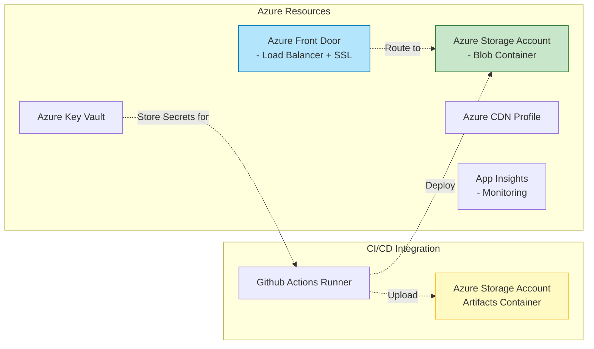
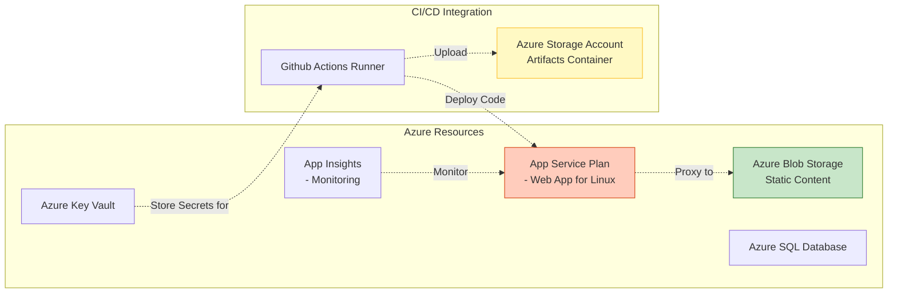

# Deployment Guidelines

This document provides comprehensive guidelines for deploying the application through the CI/CD pipeline, covering Azure infrastructure setup, deployment configurations, and environment management.

---

## Table of Contents

1. [Azure Infrastructure Setup](#azure-infrastructure-setup)
2. [Deployment Configuration](#deployment-configuration)
3. [Environment-Specific Settings](#environment-specific-settings)
4. [Deployment Automation](#deployment-automation)
5. [Health Checks & Monitoring](#health-checks--monitoring)
6. [Rollback Procedures](#rollback-procedures)
7. [Troubleshooting Guide](#troubleshooting-guide)

---

## Azure Infrastructure Setup

### Option 1: Azure Blob Storage + Static Web App

#### Prerequisites

- Azure subscription with appropriate permissions
- Ability to create and manage the following resources:
  - Azure Storage Account (Blob)
  - Azure Front Door or Application Gateway
  - Azure CDN Profile
  - Azure Key Vault
  - Azure DNS Zone

#### Resource Deployment



#### Configuration Files

Create the following ARM/Bicep templates:

**1. Storage Account (arm-storage.json):**
```json
{
  "$schema": "https://schema.management.azure.com/schemas/2019-04-01/deploymentTemplate.json#",
  "contentVersion": "1.0.0.0",
  "resources": [
    {
      "type": "Microsoft.Storage/storageAccounts",
      "apiVersion": "2022-11-01",
      "name": "[parameters('storageAccountName')]",
      "location": "[parameters('location')]",
      "sku": {
        "name": "Standard_LRS"
      },
      "kind": "StorageV2",
      "properties": {
        "cors": [
          {
            "allowedOrigins": ["*"],
            "allowedMethods": ["GET", "HEAD", "PUT", "POST", "DELETE", "OPTIONS", "PATCH"]
          }
        ],
        "publicAccess": "Blob"
      }
    },
    {
      "type": "Microsoft.Storage/storageAccounts/blobServices",
      "apiVersion": "2022-11-01",
      "name": "[concat(parameters('storageAccountName'), '/default')]",
      "dependsOn": ["[resourceId('Microsoft.Storage/storageAccounts', parameters('storageAccountName'))]"],
      "properties": {
        "cors": [
          {
            "allowedOrigins": ["*"],
            "allowedMethods": ["GET", "HEAD", "PUT", "POST", "DELETE", "OPTIONS", "PATCH"]
          }
        ],
        "deleteRetentionPolicy": null,
        "isHTTPSOnlyForBlobPrefixes": true
      }
    }
  ]
}
```

**2. Front Door (arm-frontdoor.json):**
```json
{
  "$schema": "https://schema.management.azure.com/schemas/2019-04-01/deploymentTemplate.json#",
  "contentVersion": "1.0.0.0",
  "resources": [
    {
      "type": "Microsoft.Network/frontdoors",
      "apiVersion": "2021-07-01",
      "name": "[parameters('frontDoorName')]",
      "location": "[parameters('location')]",
      "sku": {
        "name": "Standard_AzureFrontDoor"
      },
      "properties": {
        "frontendEndpoints": [
          {
            "name": "app",
            "hostNames": [
              "[parameters('domainName')]"
            ],
            "port": 443,
            "pathBasedRoutingEnabled": false,
            "minimumTLSVersion": "1.2"
          }
        ],
        "backendPools": [],
        "httpRedirectConfiguration": null,
        "accessLogsConfiguration": {
          "enabled": true,
          "storageAccountName": "[parameters('storageAccountName')]",
          "protocol": "Https",
          "formatVersion": 2,
          "metricName": "app"
        }
      }
    }
  ]
}
```

### Option 2: Azure App Service

#### Prerequisites

- Azure subscription with appropriate permissions
- Ability to create the following resources:
  - App Service Plan (Consumption or Basic+)
  - Azure Blob Storage
  - Azure Key Vault
  - Azure SQL Database / Cosmos DB
  - App Insights

#### Resource Deployment



#### Configuration Files

**1. App Service (arm-appservice.json):**
```json
{
  "$schema": "https://schema.management.azure.com/schemas/2019-04-01/deploymentTemplate.json#",
  "contentVersion": "1.0.0.0",
  "resources": [
    {
      "type": "Microsoft.Web/sites",
      "apiVersion": "2022-09-01",
      "name": "[parameters('appName')]",
      "location": "[parameters('location')]",
      "kind": "app,linux,floating",
      "identity": {
        "type": "systemAssigned"
      },
      "properties": {
        "httpsOnly": true,
        "reserved": false,
        "siteConfig": {
          "alwaysOn": true,
          "http20Enabled": true,
          "ftpsState": "Disabled",
          "minTlsVersion": "1.2"
        },
        "scmSiteAlsoStopped": false,
        "httpsPath": "/",
        "serverFarmId": "[parameters('appServicePlanId')]"
      }
    }
  ]
}
```

---

## Deployment Configuration

### GitHub Actions Workflow Structure

**1. Test Workflow (`.github/workflows/test.yml`):**

```yaml
name: Test Workflow

on:
  push:
    branches: [main]
  pull_request:
    branches: [main]

jobs:
  test:
    runs-on: ubuntu-latest
    
    steps:
      - uses: actions/checkout@v4
      
      - name: Setup Node.js
        uses: actions/setup-node@v4
        with:
          node-version: '20'
          cache: 'npm'
      
      - name: Install Dependencies
        run: npm ci
        
      - name: Lint Check
        run: npm run lint
      
      - name: Unit Tests
        run: npm test --ci
        
      - name: Integration Tests
        run: npm run test:integration
        
      - name: Build Application
        run: npm run build
        env:
          CI: true
          
      - name: Upload Artifacts to Azure
        uses: azure/upload-artifact-to-azure-storage@v1
        with:
          storage-account-name: '${{ secrets.STORAGE_ACCOUNT_NAME }}'
          storage-key: ${{ secrets.STORAGE_ACCOUNT_KEY }}
          container-name: 'artifacts-${{ github.ref }}'
          path: './dist/'
```

**2. Deploy Workflow (`.github/workflows/deploy.yml`):**

```yaml
name: Deploy Workflow

on:
  workflow_dispatch:
    inputs:
      environment:
        description: 'Target environment'
        required: true
        type: choice
        options:
          - dev
          - prod
      
  push:
    branches: [main]

jobs:
  deploy:
    runs-on: ubuntu-latest
    
    steps:
      - uses: actions/checkout@v4
      
      - name: Setup Node.js
        uses: actions/setup-node@v4
        with:
          node-version: '20'
          
      - name: Download Build Artifacts
        uses: azure/download-artifact-azure-storage@v1
        with:
          storage-account-name: '${{ secrets.STORAGE_ACCOUNT_NAME }}'
          storage-key: ${{ secrets.STORAGE_ACCOUNT_KEY }}
          container-name: 'artifacts-main'
          path: './dist/'
          
      - name: Run Production Tests
        run: npm test --ci
        
      - name: Deploy to App Service (or Blob)
        if: github.event.inputs.environment == 'prod' || startsWith(github.ref, 'refs/heads/main')
        uses: azure/arm-deploy@v2
        with:
          subscription-id: ${{ secrets.AZURE_SUBSCRIPTION_ID }}
          resource-group: '${{ secrets.RESOURCE_GROUP_NAME }}'
          template: './infra/prod.bicep'
          parameters: 'appName=${{ inputs.environment === "prod" && secrets.PROD_APP_NAME || secrets.DEV_APP_NAME }},location=${{ secrets.AZURE_LOCATION }}'
          
      - name: Health Check
        run: |
          sleep 30  # Wait for deployment to complete
          curl -I https://${APP_URL}/health
      
      - name: Smoke Tests
        run: npm run test:smoke
```

---

## Environment-Specific Settings

### Environment Variables

Create `.env` files for each environment:

**Development (`.env.development`):**
```bash
# Application Configuration
NODE_ENV=development
APP_PORT=3000

# Azure Configuration
AZURE_SUBSCRIPTION_ID=${{ secrets.AZURE_SUBSCRIPTION_ID }}
AZURE_RESOURCE_GROUP=dtap-automation-dev
AZURE_LOCATION=westeurope

# Environment URLs
AZURE_APP_URL=https://dev.dtappoc.azurewebsites.net
AZURE_BLOB_CONTAINER=dev-content

# Feature Flags
ENABLE_DEBUG_MODE=true
ENABLE_METRICS=true
ENABLE_FEATURE_NEW-flow=false

# API Endpoints
API_ENDPOINT=http://localhost:3001
AUTH_SERVICE_URL=https://dev-auth.service.com
```

**Production (`.env.production`):**
```bash
# Application Configuration
NODE_ENV=production
APP_PORT=80

# Azure Configuration
AZURE_SUBSCRIPTION_ID=${{ secrets.AZURE_SUBSCRIPTION_ID }}
AZURE_RESOURCE_GROUP=dtap-automation-prod
AZURE_LOCATION=westeurope

# Environment URLs
AZURE_APP_URL=https://prod.dtappoc.azurewebsites.net
AZURE_BLOB_CONTAINER=prod-content

# Feature Flags
ENABLE_DEBUG_MODE=false
ENABLE_METRICS=true
ENABLE_FEATURE_new-flow=true

# API Endpoints
API_ENDPOINT=${{ secrets.API_ENDPOINT }}
AUTH_SERVICE_URL=${{ secrets.AUTH_SERVICE_URL }}

# Security
ENABLE_HTTPS=true
ENABLE_CSP=true
```

### Environment-Specific Deployments

| Setting | Development | Production |
|---------|-------------|------------|
| **App Service Plan** | Consumption (Free tier) | Standard P1v2 |
| **VNet Integration** | Optional | Required |
| **Diagnostics Level** | Detailed | Minimal |
| **Scaling** | 1 instance | 3+ instances |
| **Session Affinity** | Disabled | Enabled |
| **Health Checks** | Every 60s | Every 15s |

---

## Deployment Automation

### Pre-Deployment Checklist

Before every deployment, the automation verifies:

```yaml
# Automated Validation Steps
steps:
  - name: Validate Environment Configuration
    run: npm run validate-env
    
  - name: Check Previous Deployment Status
    run: npm run check-deployment-status
    
  - name: Verify Secrets Loaded
    run: |
      if ! grep -q "DEPLOYMENT_STATUS=SUCCESS" /tmp/deployment.log; then
        echo "Previous deployment not successful, aborting"
        exit 1
      fi
      
  - name: Run Security Scan
    uses: secureup/scan@v2
    with:
      path: ./dist
      output: security-report.json
```

### Post-Deployment Actions

After successful deployment:

```yaml
steps:
  - name: Update Deployment Timestamp
    run: echo "DEPLOYED_AT=$(date -u +%Y-%m-%dT%H:%M:%SZ)" >> $GITHUB_ENV
    
  - name: Trigger Health Checks
    run: npm run health-checks -- --all-endpoints
    
  - name: Notify Stakeholders
    uses: slack/notify-slack@v2
    with:
      message: "✅ Deployment to ${{ env.environment }} completed successfully!"
      webhook-url: ${{ secrets.SLACK_WEBHOOK_URL }}
      
  - name: Update Monitoring Dashboards
    run: az monitor dashboard create --resource-group monitoring
    
  - name: Archive Build Artifacts
    uses: azure/upload-artifact-to-azure-storage@v1
    with:
      storage-account-name: ${{ secrets.STORAGE_ACCOUNT_NAME }}
      container-name: 'artifacts-releases'
```

---

## Health Checks & Monitoring

### Health Check Endpoints

Create health check routes in your application:

```javascript
// Example health check implementation
app.get('/health', (req, res) => {
  const healthCheck = {
    status: 'healthy',
    timestamp: new Date().toISOString(),
    uptime: process.uptime(),
    version: package.version,
    services: {
      database: await checkDatabaseConnection(),
      cache: await checkRedisConnection(),
      externalApi: await checkExternalService()
    }
  };
  
  res.status(healthCheck.status === 'healthy' ? 200 : 503).json(healthCheck);
});
```

### Health Check Configuration

**1. App Service Health Settings (`web.config` or Kudu settings):**
```xml
<!-- web.config for IIS -->
<configuration>
  <system.webServer>
    <httpProtocol requestFiltering="none">
      <customHeaders>
        <add name="X-Health-Status" value="healthy" />
      </customHeaders>
    </httpProtocol>
  </system.webServer>
</configuration>
```

**2. GitHub Actions Health Check Step:**
```yaml
- name: Health Check
  run: |
    DEPLOYMENT_STATUS="SUCCESS"
    
    for i in {1..5}; do
      HTTP_CODE=$(curl -s -o /dev/null -w "%{http_code}" $APP_HEALTH_URL)
      
      if [ "$HTTP_CODE" = "200" ]; then
        echo "Health check passed with status $HTTP_CODE"
        break
      else
        echo "Health check failed with status $HTTP_CODE, retrying..."
        sleep 5
      fi
      
      if [ $i -eq 5 ]; then
        DEPLOYMENT_STATUS="FAILED"
      fi
    done
    
    echo "DEPLOYMENT_STATUS=$DEPLOYMENT_STATUS" >> $GITHUB_ENV
```

### Monitoring Setup

**1. App Insights Configuration:**
```json
{
  "samplingSettings": {
    "isEnabled": true,
    "minCpuTimeInMilliseconds": 30000,
    "maxBytesSent": 5242880
  },
  "dependencyTracking": {
    "isDbDependencyTrackingEnabled": true,
    "isDbConnectionDetailCaptured": false,
    "isPropagationTagsCaptureEnabled": true
  }
}
```

**2. Custom Alerts:**
```json
{
  "emailAlerts": [
    {
      "name": "DeploymentFailed",
      "description": "Triggered when deployment fails",
      "operator": "=",
      "metricName": "DeploymentStatus",
      "threshold": 0,
      "durationInMinutes": 15,
      "enabled": true
    }
  ]
}
```

---

## Rollback Procedures

### Automatic Rollback

Configure automatic rollback for failed deployments:

```yaml
- name: Failed Deployment - Auto Rollback
  if: ${{ failure() && env.DEPLOYMENT_STATUS == 'FAILED' }}
  run: |
    echo "🔄 Initiating automatic rollback..."
    
    # Get previous version from deployment history
    PREVIOUS_VERSION=$(az appservice deployment list \
      --resource-group dtap-automation-prod \
      --name $APP_NAME \
      --query "[?deploymentMode=='Manual'][?operation=='Pull Request'][0].id" \
      -o table)
    
    # Rollback to previous version
    az appservice deployment rollback \
      --resource-group dtap-automation-prod \
      --name $APP_NAME \
      --slot-production
    
    echo "📋 Rollback completed. Previous version restored."
```

### Manual Rollback via Azure Portal

**Steps to manually rollback:**

1. Open Azure Portal: <https://portal.azure.com>
2. Navigate to App Service or Front Door resource
3. Go to **Deployments** blade
4. Click **Roll back to previous deployment**
5. Review the changes that will be reverted
6. Click **Rollback now**

### Rollback Checkpoint List

After rollback, verify:
- [ ] Previous version is running
- [ ] Health checks pass
- [ ] Smoke tests succeed
- [ ] Monitoring shows no errors
- [ ] Stakeholders notified

---

## Troubleshooting Guide

### Common Issues and Solutions

**Issue 1: Deployment Fails - "Build Error"**

```bash
# Solution: Check build logs in GitHub Actions
# 1. Go to repository → Actions → Deploy Workflow
# 2. Find failed run
# 3. Click on the failing step for full output
```

**Issue 2: Health Checks Fail After Deployment**

```bash
# Solution: Wait for warmup period (App Service needs time to start)
# Command:
curl https://yourapp.com/health
# Expected response after warmup:
# {"status":"healthy","uptime":123456}
```

**Issue 3: Artifacts Not Found in Azure Storage**

```bash
# Solution: Verify upload step completed
az storage container list \
  --account-name $STORAGE_ACCOUNT_NAME \
  --query "[?name=='artifacts-main']" \
  --output table
```

### Debug Mode Activation

Enable debug logging for troubleshooting:

```yaml
- name: Enable Debug Logs (Temporary)
  if: ${{ needs.debug }} && github.event.inputs.enable_debug == 'true' }
  run: |
    npm install -g debug
    DEBUG=* npm test --ci
    
    # Upload debug logs to artifacts
    zip -r debug-logs.zip dist/ uploads/ logs/
```

### Monitoring Commands

**Azure CLI for Deployment Verification:**

```bash
# Check deployment status
az appservice deployment list \
  --resource-group dtap-automation-prod \
  --name $APP_NAME
  
# Get latest deployment details
az appservice deployment show \
  --resource-group dtap-automation-prod \
  --name $APP_NAME \
  --slot production \
  --query "{id,state,targetDeploymentUrl}" \
  --output table
  
# View deployment logs
az appservice deployment logs list \
  --resource-group dtap-automation-prod \
  --name $APP_NAME \
  --slot production \
  --start-time $(Get-Date -HourFormat 24) \
  --end-time $(Get-Date -HourFormat 24).AddMinutes(30) \
  --query "[0].{Timestamp,Message}"
```

---

## Security Considerations

### Secrets Management

Never commit secrets to repository:

**❌ DON'T DO:**
```yaml
# Incorrect - commits secrets
secrets:
  STORAGE_KEY: "my-secret-key"
  API_SECRET: "another-secret"
```

**✅ DO DO:**
```yaml
# Correct - use Azure Key Vault references
env:
  STORAGE_CONNECTION_STRING: ${{ secrets.STORAGE_CONNECTION_STRING }}
  API_SECRET: ${{ secrets.API_SECRET }}
```

### Network Security

Configure NSG rules:

```json
{
  "networkSecurityGroup": {
    "allowedInboundPorts": [80, 443],
    "allowedOutboundEndpoints": [
      "storage.azure.com",
      "keyvault.azure.net",
      "monitor.azure.com"
    ]
  }
}
```

---

*Last updated: 2026-09-09*

**For more information, see:**
- [architecture-summary.md](<docs/architecture-summary.md>) - Azure infrastructure options
- [assumptions.md](<docs/assumptions.md>) - Technical assumptions
- [workflow-guidelines.md](<docs/workflow-guidelines.md>) - CI/CD workflow procedures