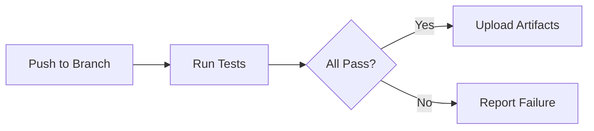
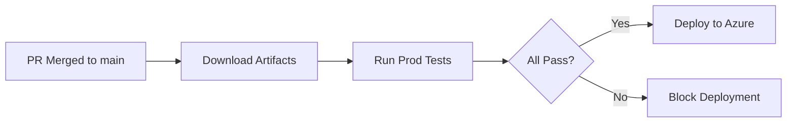

# Developer Onboarding Guide

Welcome to the dtap-automation PoC repository! This guide will help you get started quickly and contribute effectively.

---

## Quick Start (5 Minutes)

### Step 1: Clone the Repository

```bash
git clone <repository-url>
cd dtap-automation
git pull origin main
```

### Step 2: Review Documentation

Read these documents in order:

1. **[README.md](<README.md>)** - Understand the PoC objectives and branch strategy
2. **[docs/architecture-summary.md](<docs/architecture-summary.md>)** - Learn about Azure deployment options
3. **[docs/assumptions.md](<docs/assumptions.md>)** - Review organizational assumptions
4. **[docs/workflow-guidelines.md](<docs/workflow-guidelines.md>)** - Understand CI/CD workflows

### Step 3: Set Up Your Environment

```bash
# Install dependencies
npm install

# Verify local setup
npm run build
npm test
```

### Step 4: Create Your First Issue

```bash
# Navigate to GitHub Issues
# Create issue with clear title and description

# Example:
# Title: Fix login page loading timeout on high-latency networks
# Description: Add retry logic with exponential backoff
# Labels: bug, high-priority
```

---

## Your First Contribution (15 Minutes)

### Step 1: Create Issue (Required)

**Never start work without an issue!**

1. Open GitHub Issues
2. Create a new issue for your change
3. Include:
   - Clear description
   - Acceptance criteria
   - Relevant labels (bug, feature, enhancement)

### Step 2: Create Feature Branch

```bash
# Create branch from main
git checkout -b feature/XXX-description

# Example:
git checkout -b feature/123-fix-login-timeout
```

### Step 3: Make Your Changes

Edit code files, write tests, and commit:

```bash
git add .
git commit -m "feat(login): implement retry logic for high-latency networks"

# Push to trigger CI
git push origin feature/123-fix-login-timeout
```

### Step 4: Wait for Tests

GitHub Actions will automatically run tests. Check the workflow status in GitHub UI.

### Step 5: Create Pull Request

Once tests pass:

```bash
# Submit PR via GitHub web UI (recommended) or CLI
gh pr create --title "Fix login timeout - issue-XXX" \
             --body "Addresses the login timeout issue..."
```

### Step 6: Get Review

- Wait for review from team member(s)
- Address any feedback
- Push additional commits if needed

### Step 7: Merge and Deploy

Once approved:

- Click "Merge pull request" or wait for automated merge
- Deployment happens automatically to target environment
- Verify deployment in monitoring tools

---

## Workflow Checklist

Before starting ANY work:

- [ ] GitHub Issue created with clear description
- [ ] Acceptance criteria defined
- [ ] Labels assigned (bug, feature, enhancement)

Before committing code:

- [ ] Code follows project conventions
- [ ] Tests written for new functionality
- [ ] Changes are minimal and focused

Before merging PR:

- [ ] All status checks pass (linting, tests, build)
- [ ] At least one review approval received
- [ ] Feedback addressed if changes requested

---

## Best Practices

### Code Style

Follow the project's code style automatically enforced by:

- ESLint for JavaScript/TypeScript
- Prettier for formatting
- Git hooks (if configured)

Run locally before committing:

```bash
npm run lint
npm run format
```

### Writing Tests

Always write tests alongside new code:

```javascript
// Example test file structure
describe('login-service', () => {
  describe('retry logic', () => {
    it('should retry on timeout with exponential backoff', async () => {
      // Test implementation
    });
    
    it('should respect max retry attempts', async () => {
      // Test implementation
    });
  });
});
```

### Documentation

Update documentation when:

- Adding new features
- Changing behavior
- Modifying configuration options

---

## Environment Configuration

### Development (.env.development)

```bash
NODE_ENV=development
AZURE_APP_URL=https://dev.environment.app
ENABLE_DEBUG_MODE=true
```

### Production (.env.production)

```bash
NODE_ENV=production
AZURE_APP_URL=https://prod.environment.app
ENABLE_DEBUG_MODE=false
```

---

## Azure Deployment Options

Choose one of two deployment architectures:

1. **Azure Blob Storage + Front Door** - Best for static-heavy sites
2. **Azure App Service** - Best for full web applications

See **[docs/architecture-summary.md](<docs/architecture-summary.md>)** for detailed comparison.

---

## CI/CD Workflows

### Test Workflow (Runs Automatically)



### Deploy Workflow (Runs on PR Merge)



---

## Monitoring and Debugging

### Check Deployment Status

```bash
az appservice deployment list \
  --resource-group dtap-automation-prod \
  --name $APP_NAME
```

### View GitHub Actions Logs

1. Go to repository → Actions tab
2. Select workflow run
3. Click on failing step for logs

### Access Application Logs

```bash
# Stream real-time logs
az appservice log tail \
  --resource-group dtap-automation-prod \
  --name $APP_NAME
```

---

## Security Guidelines

### Never Commit:

- ❌ API keys or secrets
- ❌ Connection strings with passwords
- ❌ `.env` files to main branch
- ❌ Large binaries (>10MB)

### Always Use:

- ✅ Azure Key Vault for secrets
- ✅ Environment variables for configuration
- ✅ GitHub Issues for change tracking
- ✅ Pull requests for code review

---

## Getting Help

### Resources

| Resource                                                       | Purpose                  |
| -------------------------------------------------------------- | ------------------------ |
| [README.md](<README.md>)                                       | Overview and objectives  |
| [docs/architecture-summary.md](<docs/architecture-summary.md>) | Azure deployment options |
| [docs/assumptions.md](<docs/assumptions.md>)                   | Organizational context   |
| [docs/workflow-guidelines.md](<docs/workflow-guidelines.md>)   | Workflow procedures      |
| [CHANGELOG.md](<CHANGELOG.md>)                                 | Release notes            |

### Communication Channels

- **GitHub Issues**: Bug reports, feature requests, change tracking
- **Pull Requests**: Code review and approval process
- **Comments/PRs**: Direct communication about changes

---

## Code Review Etiquette

### As a Requester:

1. Write clear PR descriptions
2. Wait for reviews before making more commits (squash merge)
3. Respond promptly to reviewer feedback
4. Test locally before requesting review
5. Link related issues in PR description

### As a Reviewer:

1. Check tests pass first
2. Review code quality and standards
3. Verify security implications
4. Ensure acceptance criteria are met
5. Provide clear, actionable feedback
6. Approve once all concerns addressed

---

## Release Process

When ready to release to production:

1. ✅ All tests pass in dev environment
2. ✅ Code review completed for production changes
3. ✅ Deployment scheduled (if time-sensitive)
4. ✅ Stakeholders notified
5. ✅ Post-deployment monitoring plan in place

---

## Troubleshooting Common Issues

### Issue: Tests fail after push

**Solution:**
- Check GitHub Actions logs for specific failure
- Fix failing tests locally
- Push to re-run tests
- Repeat until all pass

### Issue: PR blocked on review

**Solution:**
- Wait for team members' availability
- Ensure code is ready for review (tests pass)
- Don't spam with comments asking for review
- Be patient; quality review takes time

### Issue: Deployment fails to Azure

**Solution:**
- Check Azure resource configuration in portal
- Verify network connectivity and firewalls
- Review deployment logs in GitHub Actions
- Consider rollback if critical failure

---

## Next Steps

After reviewing this guide:

1. [ ] Read through all documentation files
2. [ ] Understand the branch strategy workflow
3. [ ] Set up your local development environment
4. [ ] Create a simple test issue and PR to practice
5. [ ] Review existing codebase structure
6. [ ] Identify one feature/bugfix to tackle

---

## Success Criteria

You're ready when you can:

- ✅ Create a GitHub issue for any change
- ✅ Create a feature branch with correct naming
- ✅ Write tests alongside new code
- ✅ Submit a quality pull request
- ✅ Understand CI/CD workflow behavior
- ✅ Navigate repository documentation effectively

---

**Questions?** Reach out through GitHub PR comments, issues, or team channels.

*Happy coding! 🚀*

---

*Last updated: 2026-09-09*