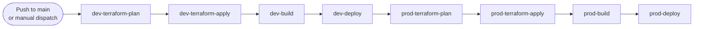
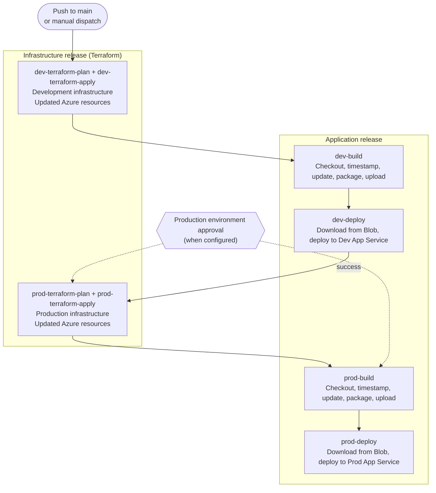
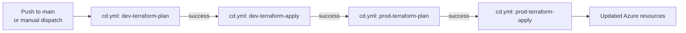
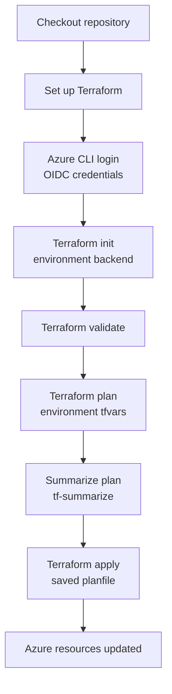
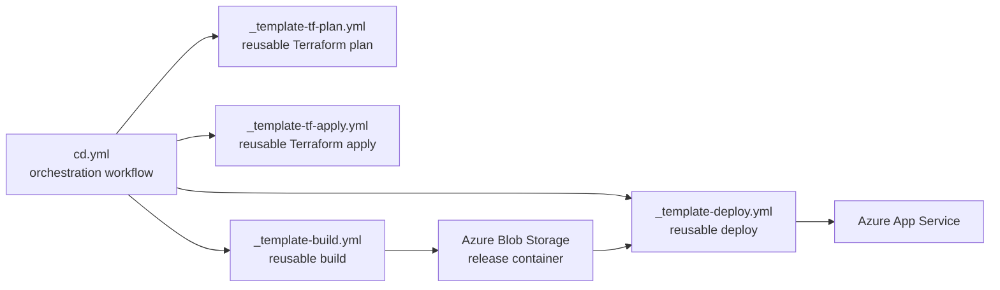

# Release flow

This document describes both release streams performed by this repository:

- **Infrastructure release (IaC)**, which plans and applies the Terraform
  configuration for Development and Production.
- **Application release**, which builds the environment-specific SPA package
  and deploys it to Azure App Service.

Both streams are now consolidated in a single [`cd.yml`](../.github/workflows/cd.yml) workflow that runs on pushes to `main` or manual dispatch. The Terraform stream promotes Development before Production; then the Application stream promotes Development before Production. This ensures infrastructure is always ready for each application deployment stage.

## When the release starts

The `cd.yml` workflow starts as follows:

The workflow uses `dtap-${{ github.ref }}` concurrency group with
`cancel-in-progress: false`, so a second run waits instead of cancelling an
existing run.

## End-to-end release overview

The workflow enforces promotion order: within each stream (Infrastructure and Application), Production cannot start until the Development operation succeeds. The Production GitHub environment can add a required reviewer gate to both the `prod` Terraform apply and the Production application jobs.

## Infrastructure release (IaC)

The infrastructure release is implemented in [`cd.yml`](../.github/workflows/cd.yml), which calls:
- [`terraform-plan-template.yml`](../.github/workflows/terraform-plan-template.yml) for each environment's plan step
- [`terraform-apply-template.yml`](../.github/workflows/terraform-apply-template.yml) for each environment's apply step

### Terraform apply steps

The reusable Terraform workflow runs on `ubuntu-latest` with the selected GitHub environment and performs these steps:

1. **Checkout** checks out the Terraform configuration.
2. **Set up Terraform** installs the configured Terraform CLI.
3. **Azure CLI login** authenticates with the environment's OIDC client,
   tenant, and subscription.
4. **Terraform init** selects the environment backend:
   `iac/dev/dev.tfbackend` or `iac/prod/prod.tfbackend`.
5. **Terraform validate** checks the configuration before planning.
6. **Terraform plan** uses the matching variable file
   (`iac/dev/dev.tfvars` or `iac/prod/prod.tfvars`) and writes `planfile`.
   The `-detailed-exitcode` result is preserved for the workflow.
7. **Plan summary** renders the plan in standard and tree formats with
   `tf-summarize`.
8. **Terraform apply** applies the saved `planfile` non-interactively.

The `dev` step calls the `Development` GitHub environment. The `prod` step has a dependency on `dev-deploy`, so it only starts after Development succeeds and can be paused for approval via the `Production` environment.

## Workflow and reusable-workflow responsibilities

| Step/job   | Responsibility                                                                                    | Gate or output                    |
| ----------- | -------------------------------------------------------------------------------------------------- | --------------------------------- |
| `dev-terraform-plan` | Runs Terraform plan for dev infrastructure in `cd.yml`.                      | Must succeed before apply.        |
| `dev-terraform-apply` | Applies dev infrastructure changes, calls `Development` environment.    | Must succeed before prod steps.   |
| `dev-build`   | Calls `_template-build.yml` for `Development` with environment code `dev`. | Publishes `package_name`.         |
| `dev-deploy`  | Calls `_template-deploy.yml` for `Development` using the build output.     | Must succeed before prod steps.   |
| `prod-terraform-plan` | Runs Terraform plan for prod infrastructure (only after dev-deploy).  | Must succeed before apply.        |
| `prod-terraform-apply` | Applies prod infrastructure changes, calls `Production` environment. | Requires approval when configured.|
| `prod-build`  | Calls `_template-build.yml` for `Production` with environment code `prod`. | Publishes `package_name`.         |
| `prod-deploy` | Calls `_template-deploy.yml` for `Production` using the build output.      | Final release step.               |

The orchestration workflow (`cd.yml`) owns ordering with `needs`. The reusable templates own the steps that run on the GitHub-hosted runner. Secrets are inherited from the selected GitHub environment, and Azure access uses the `id-token: write` permission for OIDC login.