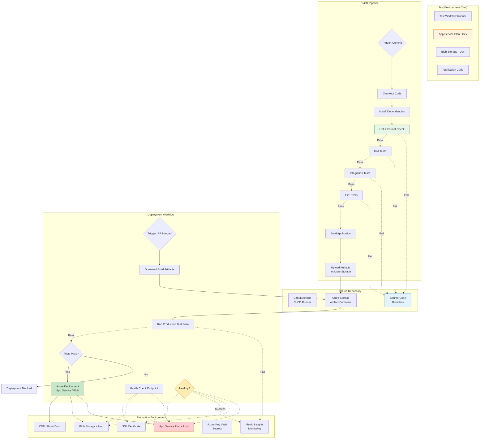
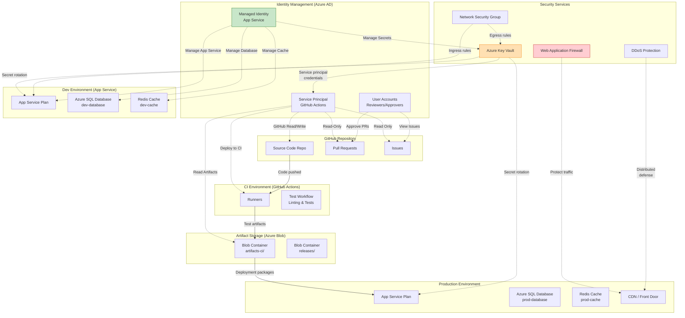
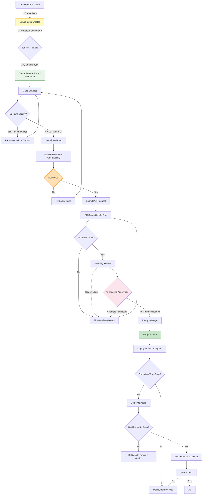

# Visual Workflows

This document contains detailed visual diagrams of the CI/CD pipeline workflows for the PoC repository.

---

## 1. Complete Branch Strategy Workflow

```mermaid
graph TB
    %% Styling definitions
    classDef human fill:#e3f2fd,stroke:#1976d2,stroke-width:2px
    classDef issue fill:#fff9c4,stroke:#fbc02d,stroke-width:2px
    classDef feature fill:#e8f5e9,stroke:#388e3c,stroke-width:2px
    classDef test fill:#ffe0b2,stroke:#f57c00,stroke-width:2px
    classDef pr fill:#fce4ec,stroke:#cr1,stroke-width:2px
    classDef approve fill:#f3e5f5,stroke:#7b1fa2,stroke-width:2px
    classDef merge fill:#dcedc8,stroke:#558b2f,stroke-width:2px
    classDef deploy fill:#ffccbc,stroke:#d84315,stroke-width:2px
    classDef success fill:#c8e6c9,stroke:#2e7d32,stroke-width:2px
    classDef fail fill:#ffcdd2,stroke:#c62828,stroke-width:2px

    %% Human actors
    A[Developer]:::human
    B[Code Reviewer 1]:::human
    C[Code Reviewer 2]:::human
    D[Approver]:::human

    %% Branches
    E[main branch<br/>(protected)]:::issue
    
    subgraph Feature Development
        F1[feature/issue-XXX]:::feature
        F2[feature/issue-YYY]:::feature
    end
    
    subgraph Test Workflow
        G1[Lint & Format Check]:::test
        G2[Unit Tests]:::test
        G3[Integration Tests]:::test
        G4[E2E Tests]:::test
        G5[Build Application]:::test
        G6[Upload Artifacts<br/>to Blob Storage]:::test
    end
    
    subgraph Pull Request
        H1[Create PR to main]:::pr
        H2[Status Checks<br/>Running]:::pr
        H3[Status Checks<br/>Passed ✅]:::pr
        H4[Awaiting Review]:::pr
    end
    
    subgraph Review Process
        I1[Request Review]:::approve
        I2[Reviewer 1 Reviews]:::approve
        I3[Request Changes? ]:::fail
        I4[Approve ✅]:::approve
        I5[Review Complete]:::approve
    end
    
    subgraph Deployment Workflow
        J1[Download Artifacts<br/>from CI]:::deploy
        J2[Run Production Tests]:::test
        J3[Deploy to Azure<br/>App Service / Blob]:::deploy
        J4[Health Checks]:::test
        J5[Smoke Tests]:::test
    end
    
    subgraph Success States
        K1[Deployment Successful ✅]:::success
        K2[Environment Updated]:::success
    end
    
    subgraph Failure States
        L1[Test Failed ❌]:::fail
        L2[PR Needs Review]:::fail
        L3[Approval Required]:::fail
        L4[Deploy Failed ❌]:::fail
    end

    %% Initial state
    A -->|1. Create GitHub Issue| E
    
    %% Feature branch creation
    E -.->|2. Checkout main| F1
    E -.->|3. Create branch| F2
    
    %% Development and testing on feature branches
    F1 -->|4. Code & Commit| G1
    G1 -.->|5. Tests run automatically| G2
    G2 -.->|6. More tests| G3
    G3 -.->|7. Final tests| G4
    G4 -.->|8. Build app| G5
    G5 -->|9. Upload artifacts| G6
    
    F2 -.->|10. Code & Commit| G1
    
    %% Test pass/fail branching
    G2 -.->|Tests Fail| L1
    G3 -.->|Tests Pass| L2
    G4 -.->|All tests pass| H1
    G6 -.->|Upload success| H1
    
    %% Pull request creation
    F1 -->|11. Submit PR| H1
    F2 -->|12. Submit PR| H3
    
    %% Status checks
    H1 --> H2
    H2 --> H3
    
    %% Review process
    H3 -.->|13. Request review| I1
    I1 --> I2
    I2 <-->|14. Discussion/Changes| I3
    I3 -.->|Push more commits| F1
    F1 --> G1
    I4 -.->|Review approved| I5
    H3 -.->|No changes needed| I5
    
    %% Approvals required
    I2 --> L3
    C -.->|15. Second review| I2
    I5 -.->|16. Ready to merge| E
    
    %% Merge to main
    E -->|17. Merge PR| K1
    K1 -->|18. Trigger deploy| J1
    
    %% Deployment workflow
    J1 --> J2
    J2 -.->|Prod tests pass| J3
    J2 -.->|Prod tests fail| L4
    
    J3 -.->|Deploy success| J4
    J4 <-->|Health checks| J5
    J5 -.->|Smoke tests pass| K1
    J5 -.->|Smoke tests fail| L4
    
    %% Success
    K1 --> K2
    
    style A fill:#e3f2fd,stroke:#1976d2
    style E stroke-dasharray: 5 5
```

---

## 2. Pull Request Review Workflow

```mermaid
flowchart LR
    subgraph PR Creation
        A[Developer] -->|Creates PR| B[Pull Request Created]
        B --> C[Status Checks Run]
    end
    
    subgraph Quality Gates
        C --> D{Linting Pass?}
        D -- No --> E[Fix Code Style Issues]
        E --> F[Re-run Linting]
        F --> D
        D -- Yes --> G{Tests Pass?}
        G -- No --> H[Fix Test Failures]
        H --> C
        G -- Yes --> I{Build Success?}
        I -- No --> J[Fix Build Errors]
        J --> C
        I -- Yes --> K[PR Ready for Review]
    end
    
    subgraph Review Process
        K --> L[Request PR Review]
        L --> M{First Review}
        M -- Approved --> N{Second Review<br/>(Optional)}
        M -- Changes Requested --> O[Implement Changes]
        O --> C
        N -- Approved --> P{All Checks Pass?}
    end
    
    subgraph Merge Decision
        P -- No --> Q[Fix Remaining Issues]
        Q --> K
        P -- Yes --> R[Ready to Merge]
        R --> S[Merge to Main]
    end
    
    subgraph Deployment Trigger
        S --> T{Deploy Workflow Triggers}
        T --> U[Deployment Executes]
    end
    
    style B fill:#fff9c4,stroke:#fbc02d
    style K fill:#e8f5e9,stroke:#388e3c
    style O fill:#ffe0b2,stroke:#f57c00
    style P fill:#fce4ec,stroke:#cr1
    style S fill:#c8e6c9,stroke:#2e7d32
```

---

## 3. Deployment Pipeline Architecture



---

## 4. Security & Access Control Diagram



---

## 5. Environment Transition Flow

```mermaid
flowchart LR
    subgraph "Development Stage"
        D1[Developer] -->|1. Create Issue| D2[Github Issue Created]
        D2 -->|2. Create Feature Branch| D3[feature/issue-XXX]
        D3 -->|3. Code & Test| D4[Tests Pass ✅]
    end
    
    subgraph "Pull Request Stage"
        D4 -->|4. Submit PR| P1[PR Created to main]
        P1 -->|5. Review Requested| P2[Awaiting Review]
        P2 -.->|Feedback loop| D3
        P2 -->|6. All Reviews Approved| P3[Ready to Merge]
    end
    
    subgraph "Merge Stage"
        P3 -->|7. Merge to main| M1[Merged ✅]
        M1 -->|8. Trigger Deploy| D5[Deploy Workflow Starts]
    end
    
    subgraph "Deployment Stage"
        D5 -->|9. Run Production Tests| DT1{Tests Pass?}
        DT1 -- No --> F1[Deployment Blocked ❌]
        DT1 -- Yes --> D6[Deploy to Azure]
        D6 --> DT2{Health Checks Pass?}
        DT2 -- No --> F2[Rollback Initiated]
        DT2 -- Yes --> M2[Deployment Complete ✅]
    end
    
    subgraph "Production Stage"
        M2 -->|10. Smoke Tests| ST1[User Accessible]
        ST1 -->|11. Monitor & Maintain| ST2[Production Live]
        ST2 -.->|Issue detected| D2
    end
    
    style D1 fill:#e3f2fd,stroke:#1976d2
    style P1 fill:#fff9c4,stroke:#fbc02d
    style M1 fill:#e8f5e9,stroke:#388e3c
    style F1 fill:#ffcdd2,stroke:#c62828
    style M2 fill:#c8e6c9,stroke:#2e7d32
```



---

## 6. Quick Reference: Decision Tree



---

## Using These Diagrams

### In Documentation
Include these diagrams in your documentation by:
1. Copying the code block
2. Placing in Markdown files with `mermaid` rendering
3. Or using tools like [Mermaid Live Editor](https://mermaid.live/) to preview first

### For Presentations
- **High-level overview**: Use diagram #1 (Complete Branch Strategy)
- **Detailed process**: Use diagrams #2-4 for specific workflows
- **Decision making**: Use diagram #6 (Quick Reference)

---

*Last updated: 2026-09-09*